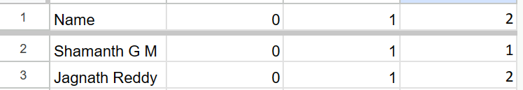
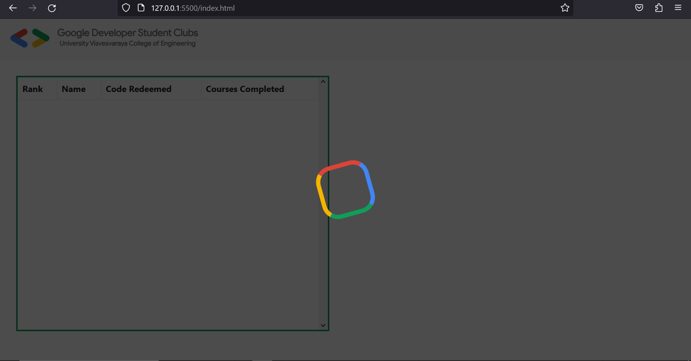
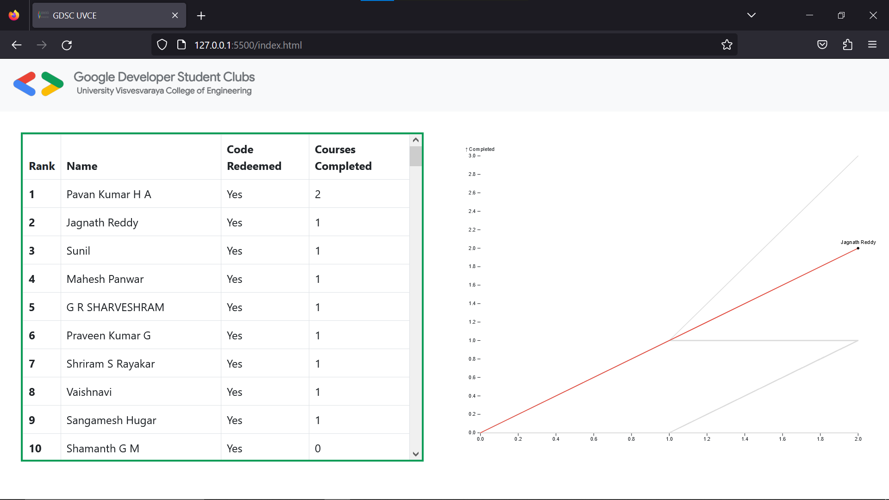

# GDSC UVCE  Google Cloud Study Jams Leaderboard

Track participents from your chapter and motivate them using this simple and interactive website 

How to use:

1)Please include all the licenses and give credits for the work

## UI
1)Make necesarry changes that suits for your need (UI)

## Javascript
1)Replace the baseURL with your URL in data.js

## API and Data
1)Data is stored in a google sheet and the using App Script Extention extract the data. *structure of data given below*

Code for App Script:

```js
function doGet(request){
  var ss = SpreadsheetApp.openById("YOUR SHEET ID");
  var sheet = ss.getActiveSheet();
  var range = sheet.getRange(1, 1,1,sheet.getLastColumn());
  var values = range.getValues();
  var rows=sheet.getRange(2,1,sheet.getLastRow(),sheet.getLastColumn()).getValues();


  if(request.parameters.final){
    var data=[];
    for(var i=0;i<rows.length-1;i++){
      var obj={};
      obj["name"]=rows[i][0];
      obj["completed"]=rows[i][values[0].length-1];
      data.push(obj);
    }
    return ContentService.createTextOutput(JSON.stringify(data)).setMimeType(ContentService.MimeType.JSON)
  }else{
  Logger.log(values)
  
  var data = [];
  for (var i=0; i < rows.length-1; i++) {
    for (var j = 1; j < values[0].length; j++) {
      var obj = {};
      obj["name"] = rows[i][0];
      obj["day"]=j-1;
      obj["completed"]=rows[i][j];
      data.push(obj);
    }
  }
  Logger.log(data);
  return ContentService.createTextOutput(JSON.stringify({data,params:[request.parameters]})).setMimeType(ContentService.MimeType.JSON);
    
  }
}

```


**Deploy your code as a web app**

## API Reference

#### Get all final reading

```http
  GET *your base link*?final=yes
```

| params | Type     | Description                |
| :-------- | :------- | :------------------------- |
| final | `{Name:String,completed:Number}` | For final reading |

#### Get plotting points

```http
  GET base_link
```

| params | Type     | Description                       |
| :-------- | :------- | :-------------------------------- |
|    | `[{name:String,day:Number,completed:Number}]` | Lots of data ehh |


# Screenshots






